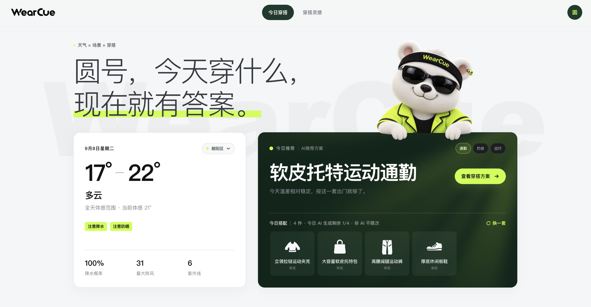
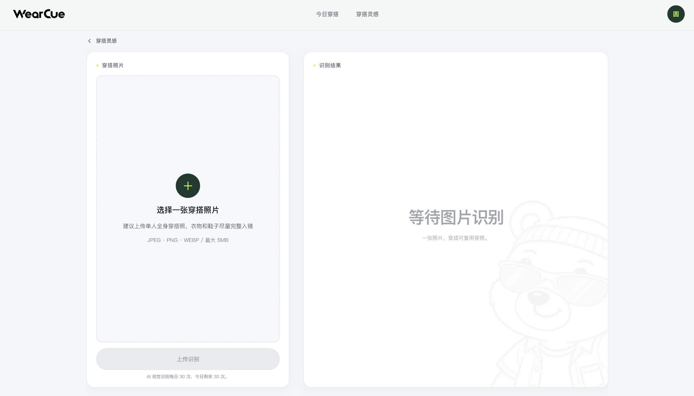
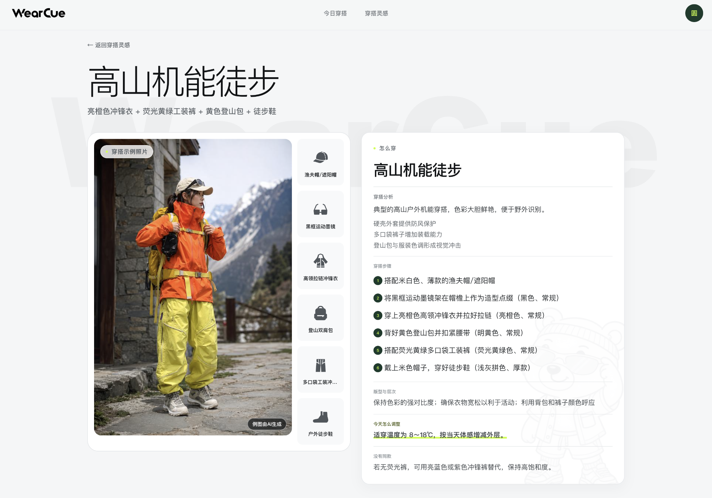

**每天少想一件事，穿什么。**

把实时天气、出行场景和个人穿搭灵感，变成今天可以直接照着穿的一套建议。

[在线体验](#online) · [产品简介](#intro) · [核心功能](#features)

## 在线体验

访问 **[WearCue 线上版](https://ss2fri90im8h5gjbjf5c8.apigateway-cn-beijing.volceapi.com/)**，直接在浏览器中使用。

已适配 **PC、平板和手机**，推荐优先使用 **PC 端访问，体验最佳**，更方便同时查看天气、穿搭示例和完整搭配建议。

### 体验范围与注册

目前采用 **邀请制，暂不开放公开注册**。注册需要邀请码，并完成邮箱验证与绑定。

### 允许访问位置和天气

首次完善资料时，请勾选页面中的 **「允许访问位置和天气」**，并在浏览器弹出位置访问请求时选择 **「允许」**。WearCue 会根据当前位置获取当地天气，用于生成当天的穿搭推荐。

晨间提醒需要另外开启浏览器通知权限，可在使用后按需设置。

## 产品简介

WearCue 是一款结合天气与生活场景的 AI 穿搭助手。
结合场景（如上班通勤、徒步旅行、外出约会），将当天体感气温和天气情况翻译成一整套穿搭，并通过 AI 给出具体穿搭方案、穿搭技巧。也能识别穿搭照片，把喜欢的造型保存下来，在合适的天气里再次推荐。

## 核心功能

### 天气 × 场景推荐

出门前，看看当天适合穿什么。WearCue 结合逐小时天气与当天体感温度，支持在通勤、约会和出行之间切换，让搭配符合今天的安排。

### 个人穿搭灵感

把自己的穿搭照或喜欢的搭配图片上传，AI 会识别服装款式、颜色与薄厚，并给出适用温度范围。确认或调整识别结果后，就能保存整套穿搭，并加入首页推荐，在体感温度和场景匹配时再次用上。

### AI 穿搭建议

看到一套喜欢的穿搭后，还需要知道怎么穿。WearCue 通过 AI 生成穿搭名称、搭配分析与具体步骤，并为系统推荐生成穿搭效果图，将示例照片、单品清单和搭配说明放在一起。

### 穿搭库管理

喜欢的搭配可以收藏起来，之后在穿搭库中查看和管理。除了保留穿搭灵感，还可以决定哪些个人穿搭参与首页推荐。

### 多设备同步

使用同一账号登录，在不同设备上访问自己的穿搭内容，继续查看和管理已保存的搭配。

个人穿搭、收藏与设置按账号保存。在 PC、平板或手机上使用同一邮箱登录，即可访问自己的内容。

### 晨间提醒

设置每天的提醒时间，在出门前及时查看当天穿搭。

开启晨间提醒并允许浏览器通知后，即可通过支持推送的浏览器接收提醒。

---

**Built with ❤️ by [@yuanhao667](https://github.com/yuanhao667)**

[在线体验](https://ss2fri90im8h5gjbjf5c8.apigateway-cn-beijing.volceapi.com/) · [反馈问题](https://github.com/yuanhao667/wearcue/issues)

